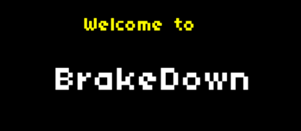
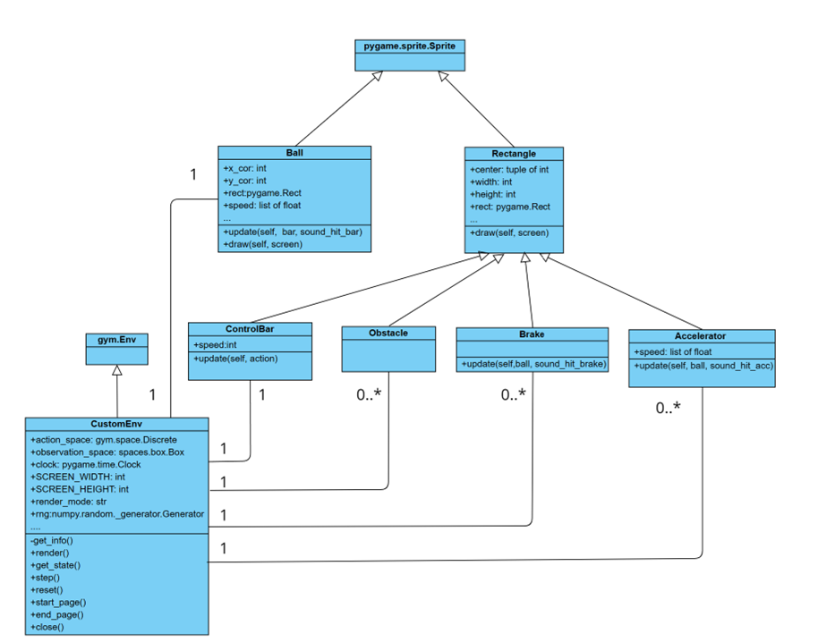

<p style="text-align: center;"><h1>BrakeDown</h1>By Tang Wai Lun & Mok Hon Wang</p> 




### Genre of BrakeDown 
BrakeDown is a 2D action game which is inspired by the classical game, Breakout, in concept and completely developed by us from scratch. We implemented the game with pygame and also created an agent to play the game with Deep Q-learning (DQN) in reinforcement learning

In the game, a moving ball is trying to escape from the prison from the bottom. However, since the ball is with strong strength, guardians are not able to catch the ball. Being the last-ditch defence of the prison, the player is going to control an indestructible horizontal bar near the bottom of the screen. However, the bar cannot catch the ball but rebound the moving ball and avoid the ball from escaping. By controlling the hitting point of the ball on the bar, the player can control the rebounded angle of the ball. 


### SetUp Environment

```
cd AIST1110_Project
conda create --name aist1110_project
conda install python
cd ball_world-game
pip install -e .
cd ..
```

### Agent training
Agent is implement with 2 model, main doel and target model, in Deep Q-learning. 

Epsilon-Greedy Exploration Strategy is chosen. In this strategy, the agent will explore more actions by random at first and add in more network movements along with the increase in episodes. 

Memory Replay as the Off-Policy is adopted. The agent uses memory replay to store the latest experience. 

The main model is trained on a minibatch of past experience according to the Bellman Equation every 4 steps and update the target model every 100 steps.

The training part of deep Q-Learning is implemented with reference to (*) and (**).


### Class diagram



### Usage

To run as human mode,

`python ball_world_game_starter/ball_world_game_play.py`

To run as Random Agent,

`python ball_world_game_starter/ball_world_game_play.py --mode human_rand`

To train Deep Q Agent,

`python ball_world_game_starter/DQN_train.py`

To test Deep Q Agent,

`python ball_world_game_starter/DQN_test.py`

### Acknowledgement of resource of BrakeDown

#### Game idea

Breakout produced by Atari. Game manual url: [https://everything2.com/title/Breakout](https://everything2.com/title/Breakout)

#### Font

Breakout_game font. By Ahmed0Khfagy. Github. url [https://github.com/aKhfagy/breakout-game/blob/master/fonts/font.ttf](https://github.com/aKhfagy/breakout-game/blob/master/fonts/font.ttf)

#### Code

Collision between objects (check_collision() function):

Python / Pygame tutorial: Collisions between static and moving objects. Youtube. url: [https://youtu.be/1_H7InPMjaY](https://youtu.be/1_H7InPMjaY)

Deep Q-Learning module (DQN_train.py):

(*)Deep Q-Learning Tutorial: minDQN. By Mike Wang. Medium. url [https://towardsdatascience.com/deep-q-learning-tutorial-mindqn-2a4c855abffc](https://towardsdatascience.com/deep-q-learning-tutorial-mindqn-2a4c855abffc)

(**)minDQN. Github. url:[https://github.com/mswang12/minDQN/blob/main/minDQN.py](https://github.com/mswang12/minDQN/blob/main/minDQN.py)

#### Music

1. Background music for starting page:  Get the Groove. By Zapsplat. url:[https://www.zapsplat.com/sound-effect-category/easy-listening/](https://www.zapsplat.com/sound-effect-category/easy-listening/)
2. Background music for main game:  Get the Groove. By Zapsplat. url:[https://www.zapsplat.com/sound-effect-	category/easy-listening](https://www.zapsplat.com/sound-effect-category/easy-listening/)
3. Sound effect for winning game: Fantasy game success notification By Mixkit. url:[https://mixkit.co/free-sound-effects/win/](https://mixkit.co/free-sound-effects/win/)
4. Sound effect for losing game: Retro arcade game over. By Mixkit. url [https://mixkit.co/free-sound-effects/lose/](https://mixkit.co/free-sound-effects/lose/)
5. Sound effect for hitting accelerator: Auto, driving - passing by, accelerating away: left to right Car Passes. By freesfx. url [https://freesfx.co.uk/Category/Cars/71](https://freesfx.co.uk/Category/Cars/71)
6. Sound effect for hitting brake: Large cork pop . By freesfx. url: [https://freesfx.co.uk/Category/Pop-Bang/253](https://freesfx.co.uk/Category/Pop-Bang/253)
7. Sound effect for hitting obstacle:  Electric door locks Car Locks. By freesfx. url: [https://freesfx.co.uk/Category/Cars/71](https://freesfx.co.uk/Category/Cars/71)
8. Sound effect for hitting control bar: Bike notification bell. By mixkit. url: [https://mixkit.co/free-sound-effects/bell/](https://mixkit.co/free-sound-effects/bell/)

#### Image

Background: Stones & Brick Textures. By Pucci-games. url: [https://pucci-games.itch.io/stones-brick-textures](https://pucci-games.itch.io/stones-brick-textures)

Ball: Cannonball. By Dansevenstar. OpenGameArt.org. url: [https://opengameart.org/content/cannonball](https://opengameart.org/content/cannonball)
